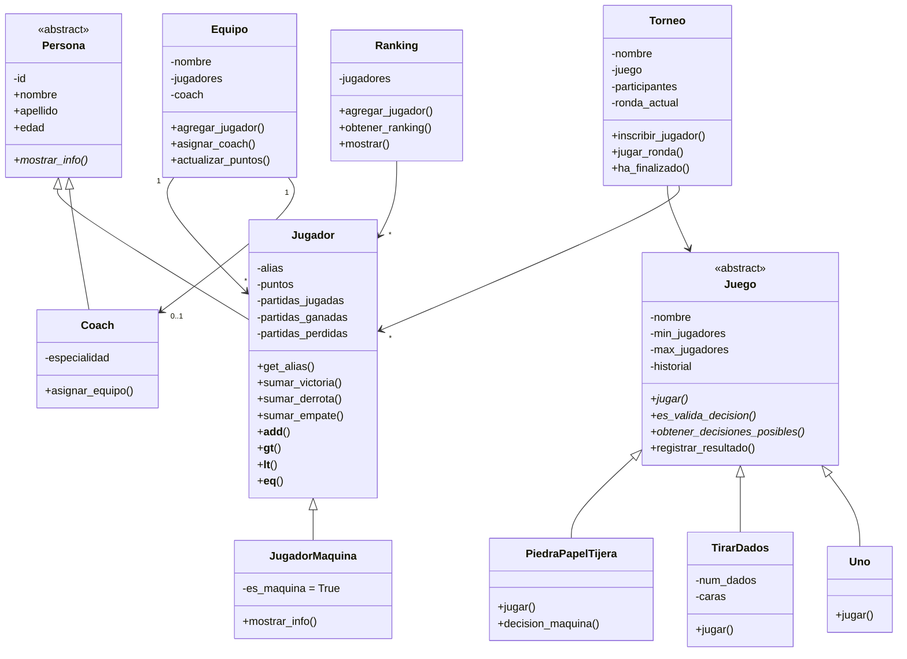

[](https://classroom.github.com/a/09uckVan)

#  Liga de Juegos de Mesa

Aplicación en Python para gestionar una **liga de juegos de mesa** con torneos eliminatorios, ranking de jugadores, equipos y coaches. Desarrollada aplicando los principios de **Programación Orientada a Objetos**.

---

##  Descripción

El sistema permite organizar competiciones entre jugadores en distintos juegos de mesa. Los jugadores acumulan puntos según sus resultados, se agrupan en equipos dirigidos por un coach, y pueden participar en torneos con formato eliminatorio 1vs1.

---

##  Estructura del proyecto

```
trabajo-final-a4/
│
├── entidades/
│   ├── persona.py          # Clase abstracta base
│   ├── jugador.py          # Hereda de Persona
│   ├── coach.py            # Hereda de Persona
│   ├── equipo.py           # Agrupa jugadores y coach
│   ├── juego.py            # Clase abstracta de juego
│   ├── piedra_papel_tijera.py
│   ├── tirar_dados.py
│   ├── uno.py
│   ├── torneo.py
│   └── ranking.py
│
├── menu.py                 # Punto de entrada con inputs
├── Main.py                 # Arranque de la aplicación
├── jugadores.json          # Persistencia de jugadores
├── coach.json              # Persistencia de coaches
├── requirements.txt
└── README.md
```

---

##  Diagrama de clases (herencia)



---

##  Flujo de funcionamiento

# cuando este acabado lo hacemos bien al flujo con el mermaid

---

##  Juegos disponibles

| Juego | Modo vs máquina | Decisión del jugador |
|---|---|---|
| Piedra Papel Tijera | Si | Elegir piedra / papel / tijera |
| Tirar Dados | Si | Automático (azar) |
| UNO | No | Automático (IA simple) |

---

##  Cómo ejecutar

```bash
# Clona el repositorio
git clone https://github.com/prog2-ia/trabajo-final-a4.git
cd trabajo-final-a4

# Instala dependencias (si las hay)
pip install -r requirements.txt

# Ejecuta la aplicación
python Main.py
```

---

## Conceptos de POO aplicados

- **Abstracción** — `Persona` y `Juego` son clases abstractas con métodos obligatorios (`@abstractmethod`)
- **Herencia** — `Jugador` y `Coach` heredan de `Persona`; `PiedraPapelTijera`, `TirarDados` y `Uno` heredan de `Juego`
- **Encapsulamiento** — atributos privados (`_alias`, `_puntos`…) accesibles solo mediante getters
- **Polimorfismo** — cada juego implementa `jugar()` de forma distinta pero con la misma interfaz
- **Sobrecarga de operadores** — `Jugador` implementa `__add__`, `__gt__`, `__lt__`, `__eq__` para comparar y sumar puntos directamente
- **Separación de responsabilidades** — `menu.py` es el único fichero con `input()`; las entidades no dependen de la interfaz

---
