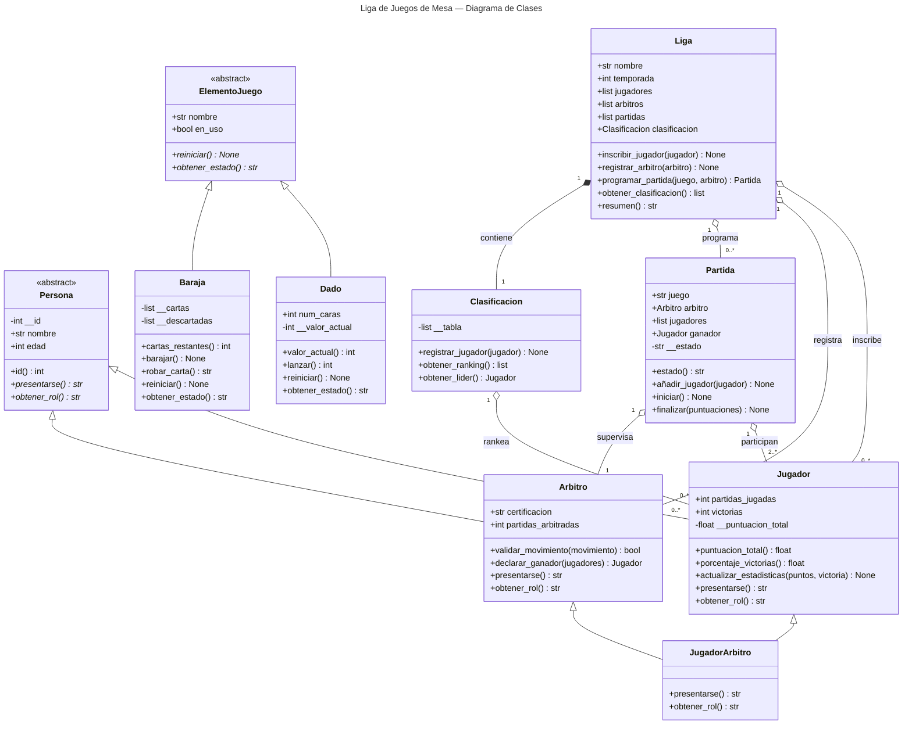

[](https://classroom.github.com/a/09uckVan)

#  Liga de Juegos de Mesa

Proyecto de **Programación Orientada a Objetos** en Python para gestionar una liga de juegos de mesa. Permite inscribir jugadores, registrar árbitros, programar partidas y llevar una clasificación actualizada.

---

## Estructura del proyecto

```
trabajo-final-a4/
├── entidades/
│   ├── __init__.py
│   ├── persona.py
│   ├── elemento_juego.py
│   ├── jugador.py
│   ├── arbitro.py
│   ├── dado.py
│   ├── baraja.py
│   ├── jugador_arbitro.py
│   ├── partida.py
│   ├── clasificacion.py
│   └── liga.py
├── games/
│   ├── __init__.py
│   ├── JuegoDadosCartas.py
│   └── JuegoPiedraPapelTijera.py
├── persistence/
│   ├── __init__.py
│   ├── PersonaRepoJson.py
│   ├── JugadorRepoJson.py
│   ├── ArbitroRepoJson.py
│   ├── JugadorArbitroRepoJson.py
│   ├── persona.json
│   ├── jugadores.json
│   ├── arbitros.json
│   └── jugador_arbitro.json
├── Main.py
├── menu.py
├── requirements.txt
└── README.md
```

---

##  Clases

| Archivo | Clase | Tipo |
|---|---|---|
| `persona.py` | `Persona` | Abstracta — base de `Jugador` y `Arbitro` |
| `elemento_juego.py` | `ElementoJuego` | Abstracta — base de `Dado` y `Baraja` |
| `jugador.py` | `Jugador` | Hereda de `Persona` |
| `arbitro.py` | `Arbitro` | Hereda de `Persona` |
| `dado.py` | `Dado` | Hereda de `ElementoJuego` |
| `baraja.py` | `Baraja` | Hereda de `ElementoJuego` |
| `jugador_arbitro.py` | `JugadorArbitro` | **Herencia múltiple** — `Jugador` + `Arbitro` |
| `partida.py` | `Partida` | Gestión de una partida concreta |
| `clasificacion.py` | `Clasificacion` | Ranking de jugadores |
| `liga.py` | `Liga` | Núcleo del sistema |

---

##  Diagrama de relaciones

> Ver archivo [`diagrama_clases.mermaid`](diagrama_clases.mermaid)


```mermaid
---
title: Liga de Juegos de Mesa — Diagrama de Clases
---
classDiagram
    direction TB

    class Persona {
        <<abstract>>
        -int __id
        +str nombre
        +int edad
        +id() int
        +presentarse()* str
        +obtener_rol()* str
    }

    class ElementoJuego {
        <<abstract>>
        +str nombre
        +bool en_uso
        +reiniciar()* None
        +obtener_estado()* str
    }

    class Jugador {
        +int partidas_jugadas
        +int victorias
        -float __puntuacion_total
        +puntuacion_total() float
        +porcentaje_victorias() float
        +actualizar_estadisticas(puntos, victoria) None
        +presentarse() str
        +obtener_rol() str
    }

    class Arbitro {
        +str certificacion
        +int partidas_arbitradas
        +validar_movimiento(movimiento) bool
        +declarar_ganador(jugadores) Jugador
        +presentarse() str
        +obtener_rol() str
    }

    class JugadorArbitro {
        +presentarse() str
        +obtener_rol() str
    }

    class Dado {
        +int num_caras
        -int __valor_actual
        +valor_actual() int
        +lanzar() int
        +reiniciar() None
        +obtener_estado() str
    }

    class Baraja {
        -list __cartas
        -list __descartadas
        +cartas_restantes() int
        +barajar() None
        +robar_carta() str
        +reiniciar() None
        +obtener_estado() str
    }

    class Partida {
        +str juego
        +Arbitro arbitro
        +list jugadores
        +Jugador ganador
        -str __estado
        +estado() str
        +añadir_jugador(jugador) None
        +iniciar() None
        +finalizar(puntuaciones) None
    }

    class Clasificacion {
        -list __tabla
        +registrar_jugador(jugador) None
        +obtener_ranking() list
        +obtener_lider() Jugador
    }

    class Liga {
        +str nombre
        +int temporada
        +list jugadores
        +list arbitros
        +list partidas
        +Clasificacion clasificacion
        +inscribir_jugador(jugador) None
        +registrar_arbitro(arbitro) None
        +programar_partida(juego, arbitro) Partida
        +obtener_clasificacion() list
        +resumen() str
    }

    Persona <|-- Jugador
    Persona <|-- Arbitro

    Jugador <|-- JugadorArbitro
    Arbitro <|-- JugadorArbitro

    ElementoJuego <|-- Dado
    ElementoJuego <|-- Baraja

    Liga "1" o-- "0..*" Jugador : inscribe
    Liga "1" o-- "0..*" Arbitro : registra
    Liga "1" o-- "0..*" Partida : programa
    Liga "1" *-- "1" Clasificacion : contiene

    Partida "1" o-- "2..*" Jugador : participan
    Partida "1" o-- "1" Arbitro : supervisa

    Clasificacion "1" o-- "0..*" Jugador : rankea
```

---

##  Requisitos

- Python 3.9
- Sin dependencias externas

---

##  Uso rápido

```python
from liga_juegos_mesa import Liga, Jugador, Arbitro

# Crear liga
liga = Liga("Liga Ibérica", temporada=1)

# Registrar personas
liga.registrar_arbitro(Arbitro("Marta", 40, "FIDE"))
liga.inscribir_jugador(Jugador("Ana", 25))
liga.inscribir_jugador(Jugador("Luis", 30))

# Programar y jugar una partida
partida = liga.programar_partida("Parchís", liga.arbitros[0])
for jugador in liga.jugadores:
    partida.añadir_jugador(jugador)

partida.iniciar()
partida.finalizar({liga.jugadores[0]: 150.0, liga.jugadores[1]: 90.0})

print(liga.resumen())
```

---

##  Conceptos de POO aplicados

- **Abstracción** — `Persona` y `ElementoJuego` como clases abstractas con `@abstractmethod`
- **Herencia simple** — `Jugador`, `Arbitro`, `Dado`, `Baraja`
- **Herencia múltiple** — `JugadorArbitro(Jugador, Arbitro)` con resolución MRO
- **Encapsulación** — atributos privados (`__id`, `__estado`, `__cartas`...) con `@property`
- **Polimorfismo** — `presentarse()` y `obtener_rol()` con comportamiento distinto por clase

